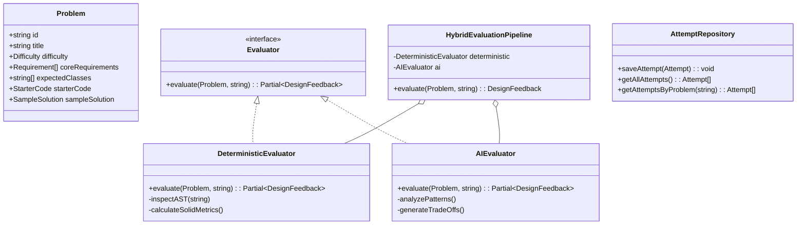

# Design Note: LLD Practice Platform Architecture & Domain Model
**Author:** Pruthvi R  
**Project:** CipherSchools 2-Day Engineering MVP  

---

## 1. System Overview & User Journey
The platform is designed as a high-velocity, low-friction practice environment. It guides the learner through a continuous improvement cycle:

---

## 2. Core Domain Model & Class Responsibilities

### Key Domain Entities:
1. **`Problem`**: Holds domain specifications, difficulty tags, functional requirements, expected entity signatures, and benchmark sample implementations.
2. **`Evaluator` (Strategy Pattern)**: Common interface permitting arbitrary evaluation implementations (Deterministic, LLM, AST, Static Linter).
3. **`HybridEvaluationPipeline`**: Coordinator implementing timeout racing, graceful degradation, and metric synthesis.
4. **`Attempt` & `AttemptRepository`**: Domain tracking capturing timestamped submissions, code snapshots, and score variations.

---

## 3. Evaluation Philosophy: Deterministic vs. LLM

| Dimension | Deterministic Engine | LLM Semantic Engine |
| :--- | :--- | :--- |
| **Speed & Availability** | $< 15$ ms; 100% offline availability; zero cost. | $500$–$1500$ ms; depends on network & quota. |
| **Strengths** | Exact entity presence, encapsulation keywords, explicit interface usage, structural SOLID heuristics. | Contextual reasoning, design pattern synthesis, architectural trade-offs, idiomatic refactoring tips. |
| **Failure Handling** | Never fails on valid text. | Protected by a **4000ms timeout boundary**. If timed out or API key missing, pipeline seamlessly degrades to deterministic mode. |

---

## 4. Key Architectural Trade-Offs

1. **In-Browser / Client-Side Orchestration vs. Distributed Worker Queues**
   - *Choice*: Evaluators and state orchestration operate in-app with localStorage persistence.
   - *Rationale*: For a 2-day MVP focusing on the learner experience, a lightweight client/monolith engine eliminates complex message brokers (RabbitMQ/Celery) while giving users sub-second interactive latency.
2. **Code/TypeScript Representation vs. Visual Drag-and-Drop UML**
   - *Choice*: Code-first (TypeScript/Pseudocode) approach.
   - *Rationale*: Real-world LLD interviews at tech companies require writing actual classes and interfaces. Visual diagram builders often introduce tedious friction without adding code-level precision.
3. **Graceful Fallback over Rigid Pipeline Blocking**
   - *Choice*: The `HybridEvaluationPipeline` executes deterministic checks first, races the AI engine against a strict timeout, and combines results.
   - *Rationale*: Guarantees that the learner *never* sees an unhandled 500 error screen or infinite loading spinner.
